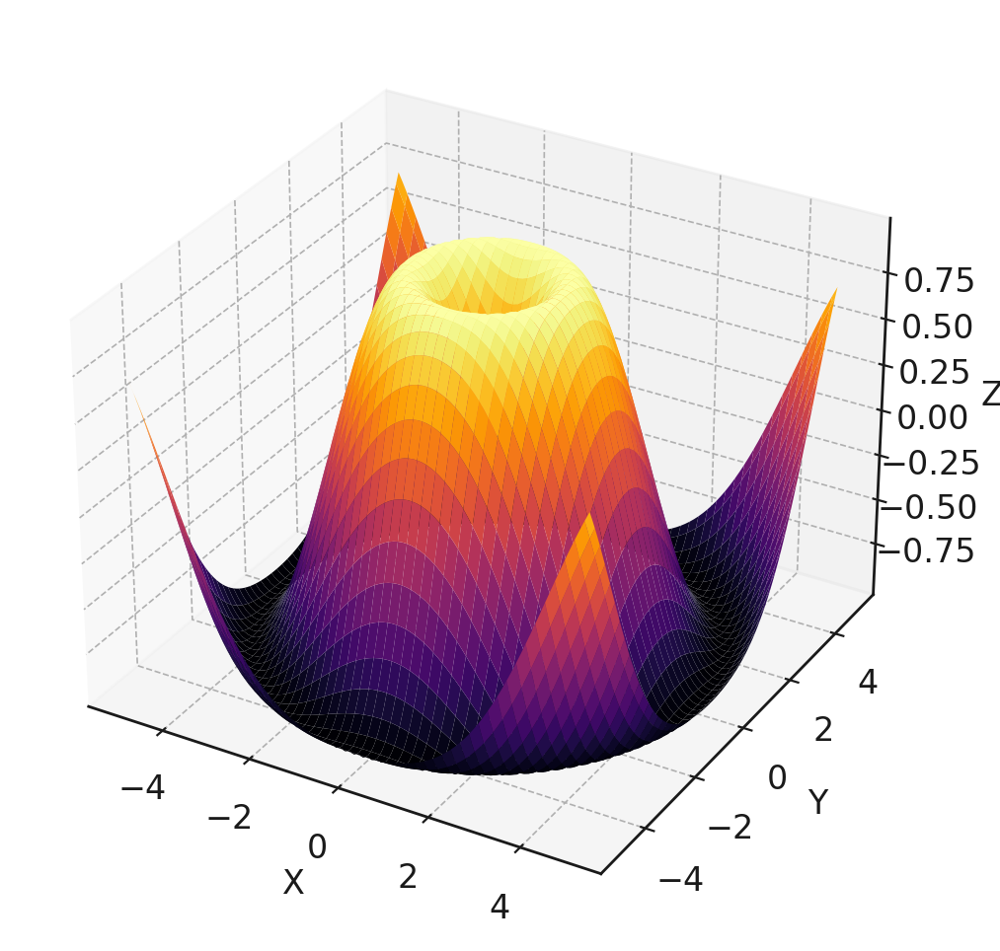
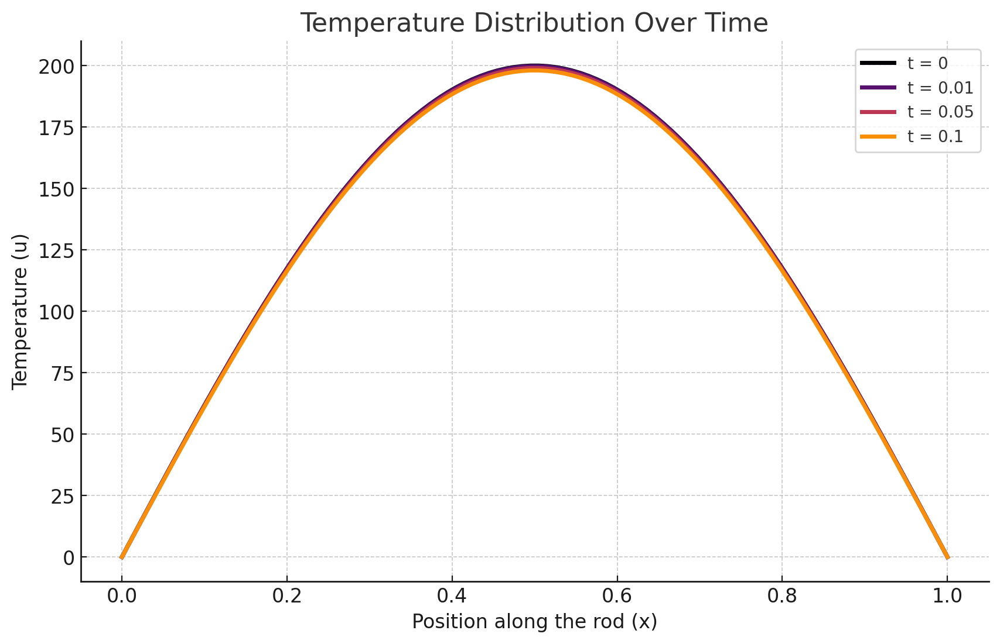
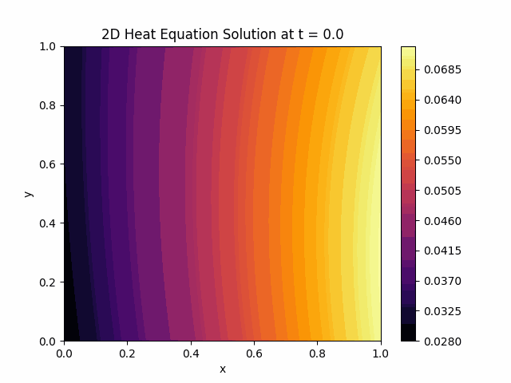


**Disclaimer:** Any opinions expressed are solely my own.


<br>



# Introduction

In today's world, numerous challenges exist, particularly in computational science. This post focuses on solving scientific problems through simulations, such as computational physics. These simulations are essential for advancing our understanding of complex systems and improving various technologies.

To understand the framework, we first need a clear vision of Partial Differential Equations (PDEs). Then, we will provide a brief overview of Physics-Informed Neural Networks (PINNs) and their implementation.

## Multivariable Calculus

Multivariable calculus extends single-variable calculus to functions with more than one variable. It involves studying functions that depend on multiple variables and covers concepts such as partial derivatives.

### Partial Derivatives

Partial derivatives refer to taking the derivative of a function that depends on more than one variable with respect to one variable while keeping the other variables constant. Partial derivatives play an important role in multivariable calculus and help us understand how functions change.

#### Definition

For a function 
$$f(x, y, z, ...)$$

the partial derivative with respect to $$x$$ is denoted as:

$$\frac{\partial f}{\partial x}$$

This represents the rate at which $$f$$ changes as $$x$$ changes, while $$y, z, \ldots$$ remain constant.

#### Notation

There are several common notations for partial derivatives: $$f_x$$ or $$\frac{\partial f}{\partial x}$$ for the partial derivative of $$ f $$ with respect to $$ x $$
#### Partial Differential Equations (PDEs)

A partial differential equation (PDE) is an equation that contains derivatives of an unknown function that depends on more than one independent variable. PDEs are used to model a wide variety of phenomena in physics, engineering, economics, and other sciences. These equations play a critical role in describing processes such as heat transfer, wave propagation, fluid dynamics, and quantum mechanics.

##### Definition

$$F\left(x_1, x_2, \ldots, x_n, u, \frac{\partial u}{\partial x_1}, \frac{\partial u}{\partial x_2}, \ldots, \frac{\partial u}{\partial x_n}, \frac{\partial^2 u}{\partial x_1^2}, \frac{\partial^2 u}{\partial x_1 \partial x_2}, \ldots \right) = 0$$

  

where $$u = u(x_1, x_2, \ldots, x_n)$$ is the unknown function, and $$F$$ is a given function.

##### Example: Heat Equation

The heat equation is a partial differential equation used to model heat diffusion processes. It describes how heat propagates in a medium over time and is often applied to different geometries, such as a rod, plate, or three-dimensional object.

###### 2D Heat Equation
`f` represents the residual of the governing partial differential equation (PDE). For the 2D heat equation, this residual is given by:
$$f = u_t - \alpha (u_{xx} + u_{yy})$$

Ideally, if the neural network perfectly satisfies the PDE, the residual `f` should be zero for all points in the domain.

Here:
$$u$$represents the temperature distribution as a function of position: $$x, y$$ and time: $$t$$the thermal diffusivity of the material: $$\alpha$$
## Problem

Solving partial differential equations (PDEs) presents several significant challenges:

- **Variability in Real-World Conditions**: Generalizing PDE solutions to unknown or variable situations accurately is challenging. Real-world scenarios often introduce complexities that are not fully captured by the training data, making it difficult to predict behavior under new conditions.
- **Limited Data**: In many scientific and engineering applications, obtaining sufficient data to cover all possible scenarios is impractical or impossible. This limitation hampers the ability to generalize the solutions effectively.
- **High Computational Demand**: Modeling complex systems, especially in multiple dimensions, can be extremely resource-intensive. Traditional numerical methods, such as finite element analysis or finite difference methods, often require significant computational power and time.
- **Resource-Intensive Simulations**: Running detailed simulations for high-fidelity models of physical systems can be prohibitively expensive and time-consuming, limiting their practicality for large-scale or real-time applications.
- **Increased Complexity**: Solving PDEs in multidimensional spaces introduces substantial complexity. The number of variables and the interactions between them can make analytical solutions intractable and numerical solutions computationally challenging.
- **Advanced Techniques Required**: Managing the complexity of multidimensional PDEs often requires advanced mathematical and computational techniques. These techniques must be robust and efficient to handle the increased data and computational demands.

By addressing these issues, we can better understand the requirements for effective PDE solutions and the potential for innovative approaches like Physics-Informed Neural Networks (PINNs) to overcome these challenges.


There are other methods in the literature, such as the Finite Difference Method (FDM) and Finite Element Method (FEM), which we cannot cover in detail in this post. If you are curious about alternative numerical techniques for solving PDEs, you can explore FDM, FEM, and other methods.


<br>

# Proposed System

## Physics-Informed Neural Networks (PINNs)

Physics-Informed Neural Networks (PINNs) offer several advantages for solving partial differential equations (PDEs). Here are some key reasons why they are needed:
#### Physical Consistency

- **Integration of Physical Laws**: PINNs incorporate physical laws, such as differential equations, directly into the model's loss function. This ensures that the model's predictions are physically consistent.
- **Compliance with General Physical Laws**: PINNs preserve the general behavior and laws of physical systems, resulting in more reliable outcomes.

#### Generalization Ability

- **Accurate Generalization**: Because PINNs integrate physical laws into the learning process, they can generalize to unknown situations beyond the training data accurately.
- **Good Performance with Relatively Little Data**: PINNs perform well even with small datasets, making them effective across various applications.

#### Efficient Calculation

- **Less Computational Power**: Compared to traditional methods, PINNs may require less computational power when modeling complex systems.
- **Numerical Stability**: Guided by physical laws, PINNs provide numerical stability and can produce more stable solutions than conventional numerical methods.

#### Wide Range of Applications

- **Use in Various Disciplines**: PINNs can be applied in engineering, biology, chemistry, economics, and many other fields. For example, they are useful in fluid dynamics, heat transfer, materials science, and biomedical engineering.
- **Multidimensional Problems**: PINNs are effective in handling multidimensional and complex systems.

#### Combination of Learning and Simulation

- **Learning and Simulation**: PINNs combine data-driven learning and physics-based simulation techniques. This approach leverages the advantages of both data and physical models to create more powerful and flexible models.

Physics-Informed Neural Networks are a powerful tool, especially for problems with data constraints and physical consistency requirements. PINNs provide innovative and effective solutions to problems that are difficult or impossible to solve using traditional methods.

# Implementation

When building PINNs, we adhere to neural network principles: inputs, hidden layers, outputs, activation functions, loss functions, etc. One of the most important parts is adding a physical loss to the classical neural network loss system to learn with physical laws.

In this post, we will implement the `Heat Equation` mentioned in the previous sections. We will extend the loss function with the `Heat Equation` loss to minimize the residual of the problem and use traditional constraints like boundaries in our neural network design.

PINNs, like other neural networks, use gradient-based numerical optimization techniques to minimize the loss function, such as backpropagation and stochastic gradient descent (SGD).
## Import Libraries
```python
import torch
import torch.nn as nn
import numpy as np
import matplotlib.pyplot as plt
```
## Build Neural Network
```python
class PINN(nn.Module):
    def __init__(self, layers):
        super(PINN, self).__init__()
        self.layers = nn.ModuleList()
        for i in range(len(layers) - 1):
            self.layers.append(nn.Linear(layers[i], layers[i + 1]))

    def forward(self, x):
        for i in range(len(self.layers) - 1):
            x = torch.tanh(self.layers[i](x))
        x = self.layers[-1](x)
        return x
```
## Define Physics-Informed Loss Function
```python
def loss_function(model, x, y, t, alpha):
    u = model(torch.cat([x, y, t], dim=1))
    
    u_x = torch.autograd.grad(u, x, grad_outputs=torch.ones_like(u), create_graph=True)[0]
    u_y = torch.autograd.grad(u, y, grad_outputs=torch.ones_like(u), create_graph=True)[0]
    u_t = torch.autograd.grad(u, t, grad_outputs=torch.ones_like(u), create_graph=True)[0]
    
    u_xx = torch.autograd.grad(u_x, x, grad_outputs=torch.ones_like(u_x), create_graph=True)[0]
    u_yy = torch.autograd.grad(u_y, y, grad_outputs=torch.ones_like(u_y), create_graph=True)[0]
    
    f = u_t - alpha * (u_xx + u_yy)
    
    return torch.mean(f ** 2)
```
## Training
```python
def train(model, optimizer, epochs, N, alpha):
    for epoch in range(epochs):
        x, y, t = generate_training_data(N)
        
        optimizer.zero_grad()
        loss = loss_function(model, x, y, t, alpha)
        loss.backward()
        optimizer.step()
        
        if epoch % 100 == 0:
            print(f'Epoch {epoch}, Loss: {loss.item()}')

layers = [3, 20, 20, 20, 1]
alpha = 0.01  # Thermal diffusivity
epochs = 1000
N = 1000

model = PINN(layers)
optimizer = torch.optim.Adam(model.parameters(), lr=0.001)

train(model, optimizer, epochs, N, alpha)
```
## Model Output: Heat Diffusion Animation

After training the Physics-Informed Neural Network (PINN) model, we can observe the heat diffusion process over time. This involves visualizing the temperature distribution across the medium, showing how heat propagates through the system.

# Conclusion

AI models offer a powerful method for solving complex partial differential equations (PDEs) by integrating physical laws into neural network training. The PINN approach ensures physical consistency, efficient computation, and accurate generalization from limited data.

In this post, we discussed the basics of PDEs, the advantages of PINNs, and demonstrated their implementation using the 2D heat equation. The results highlighted PINNs' ability to model heat diffusion accurately and efficiently.

As computational science advances, AI models are set to become invaluable tools for researchers and engineers, enabling the solution of previously intractable problems across various fields.