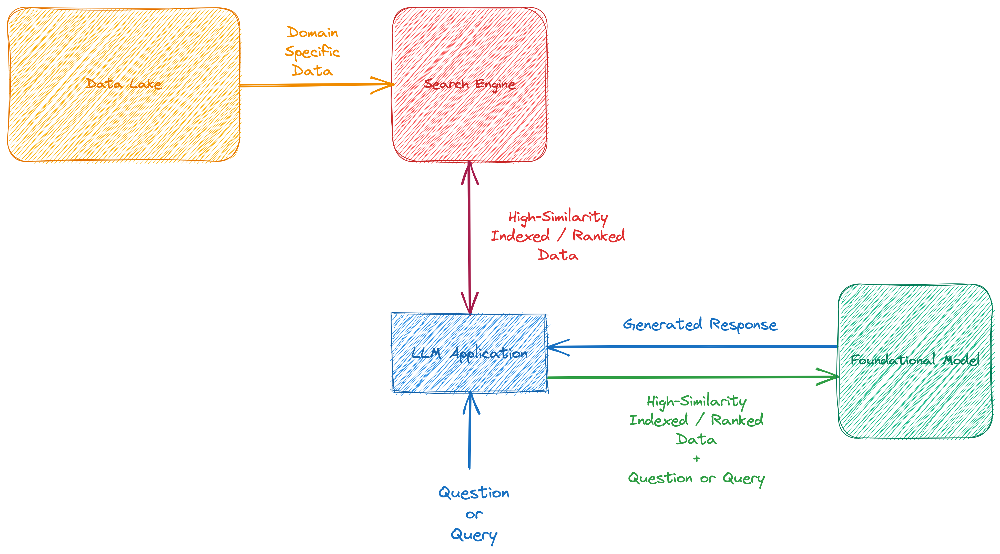


**Disclaimer:** Any opinions expressed are solely my own.


## Introduction

Numerous large language models are constantly being introduced today. Notable ones like **IBM’s Granite**[^1], **LLama** [^2], **FLAN-T5** [^3], and **Alpaca** [^4] stand out due to their unique sizes. These models perform differently on various tests like *MMLU*, *TriviaQA*, *GSM8K*, and others.

This document explores a promising solution to these challenges, known as the <abbr title="Retrieval Augmented Generation">RAG</abbr> approach. This augmentation not only elevates the accuracy of responses but also amplifies their overall effectiveness.

The proposed system offers a range of key benefits, including continuous and incremental responsiveness, adaptation to new contextual information, and a reduction in data dependencies. In the following sections, we delve into the components and flow of this innovative approach, shedding light on how it addresses the challenges posed by large language models.

## Problem

The rise of large language models brings about various difficulties:

- Models rely on **static data and lack updates** with current information.
- Despite their general-purpose design, they **lack domain-specific knowledge**.
- The process of training and generating these models incurs **substantial costs**.
- Concerns about **privacy** arise due to the absence of safeguards for private data.

These concerns make the adoption of general-purpose large language models increasingly complex in corporate environments.

## Proposed System

The Retrieval Augmented Generation (RAG) approach is one of the most effective solutions for addressing these issues. Think of <abbr title="Retrieval Augmented Generation">RAG</abbr>  as a *medicinal injection* administered to the foundational model, enhancing its response in conjunction with a *Language Model (LM)*. This augmentation not only improves response accuracy but also amplifies its effectiveness.

<abbr title="Retrieval Augmented Generation">RAG</abbr> seamlessly integrates with the capabilities of **semantic search**, drawing inspiration from the field of **Information Retrieval** [^5], and harnesses the power of artificial intelligence. These capabilities are harnessed within the context of trained data on the foundational model, as well as incorporating **enterprise-specific and domain-specific data**. The information retrieval aspect can be facilitated through technologies like *Full-Text Search* or *Vector Database*, which seamlessly communicate with the foundational model.

When your foundational model is trained solely on static data, it lacks the ability to adapt to new data and respond to evolving content. While it is possible to retrain the model to fresh data, this process can be cost-prohibitive.

The proposed system encompasses the following key procedures:

- Continuous and incremental responsiveness.
- Adaptation to new contextual information.
- Reduction of data dependencies.

### Components

#### Data Lake
The data lake serves as a repository housing a diverse range of documents, including domain-specific documentation, manuals, posts, and spreadsheets. These documents contain valuable information related to your **enterprise's memory and product details**, which are essential for your business operations.

This data is prepared for integration into our *semantic search* system.

#### Search Engine
Our search engine can be powered by *Full-Text Search*, *Vector Database* or another compatible system. These engines offer advanced capabilities tailored to your specific requirements, such as **result ranking based on input search queries**. The search engine is utilized by our `Foundational Model` to enhance and augment search results effectively.

#### Foundational Model
The foundational model can be selected from among the models currently available, such as **IBM’s Granite**[^1], **LLama** [^2] or **FLAN-T5** [^3]. I won't delve into the concept of the `Foundational Model` [^6] in this post.

#### LLM Application
The <abbr title="Large Language Model">LLM</abbr> application functions as a front-end and back-end package, accepting `Questions` or `Queries` from external sources, initiating actions, and forwarding the generated responses to other systems, such as an *API* or any user interface.

### Workflow

In the **Workflow** section, the proposed <abbr title="Retrieval Augmented Generation">RAG</abbr>  architecture is described in two main parts:

#### Part 1: Data Preparation and Indexing

1. Select, clean, and consolidate necessary documents or tables from the data lake.
2. Automate the first point using a workflow management tool such as `Airflow`.
3. Index the data into *Full-Text Search Database* or create embedding model to *Vector Database* such as `Milvus` [^7].
4. Package and create deployable objects for the third point due to the need for scheduling and fail-over nodes in the workflow.
5. Apply fine-tuning principles to the indexing process to gather the best-qualified ranking results from *Full-Text Search* or `Milvus` [^7].

I **assume** there is a deployed foundational model in a production environment.

#### Part 2: Contextual Response Generation

1. Receive a question from the `LLM Application`.
2. Execute a query on *Full-Text Search Database* or `Milvus` [^7]. and retrieve highly ranked results.
3. Concatenate the question and the results to form a context and pass it to the foundational model.
4. Take the generated response and deliver it to listener objects.

This structured flow enables the <abbr title="Retrieval Augmented Generation">RAG</abbr>  architecture to seamlessly integrate information retrieval and language generation, addressing the challenges posed by large language models.

## Conclusion

There are opportunities for improvements and enhancements to the <abbr title="Retrieval Augmented Generation">RAG</abbr> architecture, which I would like to address in this section.

#### BERT Re-ranker

You can apply advanced **re-ranking strategies** and neural engines to enhance the `Search Engine` component, including models like **ColBERT** [^8], which is a retrieval model enabling *BERT-based* search over large text collections.

#### Fine Tuning

Fine-tuning is crucial not only for language models but for any machine learning model. There are various approaches in the literature, such as **QLoRA** [^9].

#### Reinforcement Learning

There are various methods for applying *Reinforcement Learning* to generate **feedback-looped** <abbr title="Large Language Model">LLM</abbr>. These models can work with human feedback via outputs and human evaluators [^10].

Example enhancements can support your `LLM Application` in becoming more accurate, stable, and **less prone to hallucinations**.

The Retrieval Augmented Generation (RAG) approach represents a groundbreaking synergy between information retrieval and language generation, offering a promising solution to the challenges of large language models.

[^1]: [IBM’s Granite](https://www.ibm.com/blog/building-ai-for-business-ibms-granite-foundation-models/)
[^2]: [LLama](https://ai.meta.com/llama/)
[^3]: [FLAN-T5](https://huggingface.co/docs/transformers/model_doc/flan-t5)
[^4]: [Alpaca](https://crfm.stanford.edu/2023/03/13/alpaca.html)
[^5]: [Information Retrieval](https://en.wikipedia.org/wiki/Information_retrieval)
[^6]: [Foundational Models](https://en.wikipedia.org/wiki/Foundation_models)
[^7]: [Milvus](https://milvus.io)
[^8]: [ColBERT](https://github.com/stanford-futuredata/ColBERT)
[^9]: [QLoRA](https://arxiv.org/abs/2305.14314)
[^10]: [RLHF](https://huggingface.co/blog/rlhf)