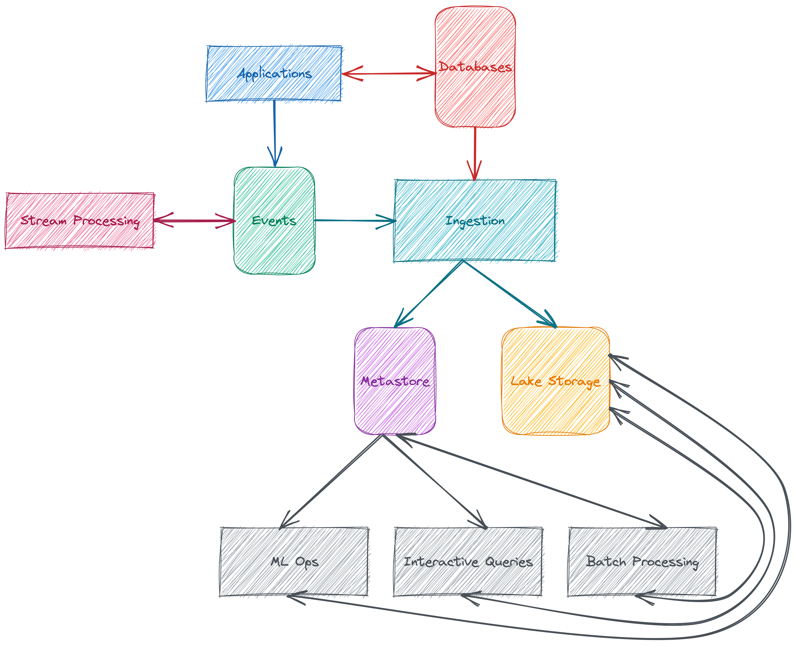
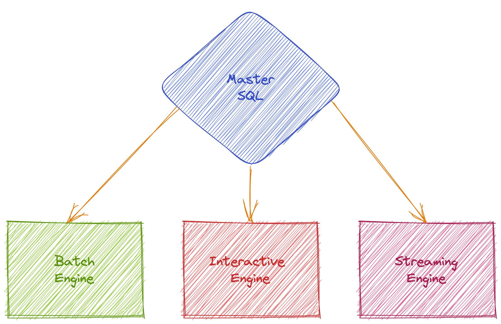
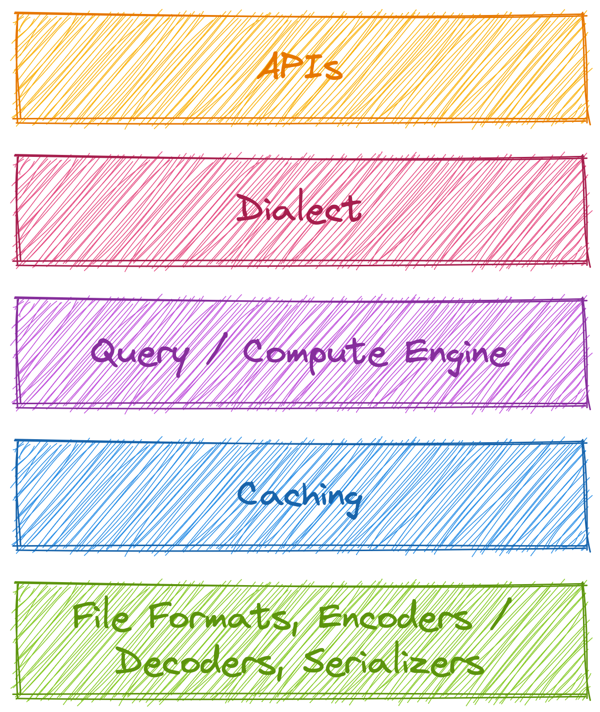


**Disclaimer:** Any opinions expressed are solely my own.


## Introduction

In today's world, nearly every product can be considered a data product. However, the ways in which they use data can vary greatly, with some being more data-intensive than others. This presents new challenges for data-reliant systems, such as ensuring data freshness and providing quick responses to queries. Businesses need to be able to gain insights from this data in a timely manner to stay competitive. Furthermore, domain data has become increasingly complex, with numerous data types like maps, tuples, arrays, and structs. 

This complexity makes it difficult to gather data through queries due to the growing number of processing stages, time series, graphs, and business logic involved.

## Problem

The system for processing and analyzing data is constantly evolving, and managing it has become increasingly difficult as the amount of data being collected continues to increase. With data platforms and infrastructure advancing at a rapid pace, duplicate components and performance issues have become more common. 

To address these challenges, scalable data teams need to develop composable components, separate concerns, and create sustainable and reusable APIs.

## Proposed System

In recent years, the industry has established several standards for data processing and storage to ensure scalability, resiliency, and efficient querying. These standards include following:

- Separating storage, compute, and metadata.
- Storing data on distributed file systems such as HDFS or object storage like MinIO.
- Using columnar data formats like ORC and Parquet.

In addition, multiple query engines like Spark, Presto, and Hive can be used simultaneously to process stored data through metastore/metadata support.

However, timely insights problems require new standards to achieve solutions, including real-time data ingestion with <abbr title="Change Data Capture">CDC</abbr> [^1] tools like Debezium [^2] and real-time stream processing using Apache Flink, Spark Streaming, and others.

#### Problem: Language & Dialect

There are various languages and dialects for data analytics, like SQL, HiveQL, and KSQL [^3], and using conventional programming languages via APIs. However, these languages generate disposable components that require rebuilding functions and readable/writable formats and serializers. 

In addition, many languages and dialects are not usable by other units and departments within an organization. One optimal solution is to use a master SQL interface such as ZetaSQL [^4] and connect interfaces and engine layers to compose concepts.

#### Problem: Query Efficiency

Efficient querying is also a significant concern for data platforms, as different query engines like Spark, Presto, or Hive use different components, languages, parsers, analyzers, libraries, and distributed executions, leading to overhead and increased latency. 

Using separate components that can be used collaboratively in other engines or components can decrease latency, maintenance costs, and management costs.

### Solution: Building Common Components

To achieve the desired outcomes, it is important to determine which components are exposed and composable to glue common components together. This should be done while following a manifesto and philosophy that addresses the following concerns:

- Having a single query/compute engine that can be used for interactive, batch, or streaming analytics.
- Sharing layers and components such as file formats, serializers, and decoders/encoders.
- Using common, sustainable, deterministic, and easy-to-use APIs that can be used to interact with other services or units.

#### Joint: Query/Compute Engine

The processing of data can be approached from various perspectives, and there are three types of engine novel data stacks available, namely batch, interactive, and streaming engines.

##### ***Batch Engine***

Batch data pipelines typically run on a scheduled basis, such as hourly, daily, or monthly, and utilize available computing resources within the designated pool. These pipelines are not generally designed for sophisticated, real-time processing, but rather for efficiency in terms of resource and time-space requirements.

The proposed system design includes batch query engines, as well as other types of engines, that can utilize the same pool of computing resources as an end-to-end layer. This extends beyond just high-level CPU and memory pools, such as those provided by Kubernetes or Mesos [^5] resource schedulers. For example, if the data stack utilizes Presto for interactive engine processing, the same SQL query can be executed on the batch engine without requiring any modifications.

##### ***Interactive Engine***

Interactive data pipelines or sessions require sub-second query performance, without data copying, and utilize in-memory for data access.

ETL jobs can be run on the interactive engine if they are efficient, but otherwise can be executed on the batch engine. If the data stack employs Spark as the batch engine, the same SQL query can be run on the interactive engine without any modifications. Additionally, all query engines within the stack share a common metastore.

##### ***Streaming Engine***

Streaming executions involve distinct concepts that differ from batch and interactive engines, including:

- Ingestion techniques from the source, such as checkpointing [^6].
- Processing techniques, such as late or watermark-based processing [^7].
- At-least-once or exactly-once sink methods and semantics [^8], as well as the synchronization of metastore partitions.
- Challenges related to schema evolution [^9].

These concepts present significant challenges that require careful resolution. Despite these differences, streaming engines share many common components, such as a front-end SQL parser and analyzer, code generation, and coordination and execution layers.

#### Joint: Storage

Modern data organizations are composed of several teams, including data scientists, data analysts, data engineers, and machine learning engineers, among others. There are various methods for accessing data, as mentioned in the post. When there is a single interface for accessing data through a Query/Compute Engine Joint, there must be one file or data representation for interacting with storage.

An emerging trend in data processing is the use of machine learning, which involves utilizing wider tables with thousands of columns for feature representation and working with higher-dimensional data [^10]. Another trend enables the seamless file finalization of real-time streaming output. Therefore, the file format used must be capable of supporting these types of data processing.

#### Joint: Execution Engine

The most performance-critical component of a data stack is the execution engine, which contains hundreds of computational functions, such as string and numerical operations [^11], that handle all processing tasks.

Typically, each query engine (batch, interactive, or streaming) has its own execution engine or layer, which utilizes several programming languages, such as Java or Scala, and various fault-tolerant mechanisms.

The proposed system design features a single execution engine that is integrable by design for every engine, including batch, interactive, and streaming. This design reduces redundant tasks, eliminates code duplication, and improves performance, while also enabling easy adoption of emerging data processing methods, such as machine learning operations. An example of this philosophy can be seen in Velox [^12].

## Conclusion

Data platforms are constantly evolving and changing, especially with the introduction of artificial intelligence innovations. The following features are essential for a modern data stack:

- Composability between engines and layers.
- Wide-area caching for each engine and layer.
- Minimal components in engines and layers.
- Wide-reaching and sustainable APIs.
- Minimal code proof.
- High efficiency and performance with low overhead through strong coordination.
- Support for machine learning operations by design.
- Low management and maintenance costs and ease of operation.

As technology advances, data stacks will become more refined and sophisticated.

[^1]: [Change Data Capture](https://en.wikipedia.org/wiki/Change_data_capture)

[^2]: [Debezium](https://debezium.io)

[^3]: [ksqlDB Overview](https://docs.confluent.io/5.4.3/ksql/docs/index.html)

[^4]: [ZetaSQL - Analyzer Framework for SQL](https://github.com/google/zetasql)

[^5]: [Apache Mesos](https://mesos.apache.org)

[^6]: [Spark Streaming Programming Guide](https://spark.apache.org/docs/latest/streaming-programming-guide.html#checkpointing)

[^7]: [Structured Streaming Programming Guide](https://spark.apache.org/docs/latest/structured-streaming-programming-guide.html#handling-late-data-and-watermarking)

[^8]: [Exactly-Once Semantics Are Possible: Here’s How Kafka Does It](https://www.confluent.io/blog/exactly-once-semantics-are-possible-heres-how-apache-kafka-does-it)

[^9]: [Schema Evolution and Compatibility](https://docs.confluent.io/platform/current/schema-registry/fundamentals/avro.html#schema-evolution-and-compatibility)

[^10]: [Feature (machine learning)](https://en.wikipedia.org/wiki/Feature_(machine_learning))

[^11]: [presto/StringFunctions.java](https://github.com/prestodb/presto/blob/master/presto-main/src/main/java/com/facebook/presto/operator/scalar/StringFunctions.java#L445)

[^12]: [Hello from Velox](https://velox-lib.io)