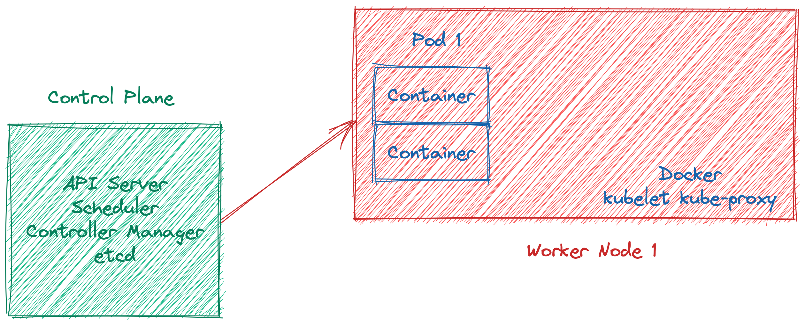

## Introduction

Kubernetes is container automation and allocator platform in short. It has built-in healing, scheduling, deployment practices (such as rollouts and rollbacks), load-balancing, and auto-scaling features. It wraps up containers as abstraction by name of Pod.

### Kubernetes architecture

## Problem

Nowadays many industries have to collect and infuse data to solve complex problems. There are many data-centric problems, from customer service to process automation on the pitch besides while the problems are increasing, data volume is growing every single day. The information technology industry should be able to provide robust, reliable, and scalable data and machine learning solutions more than in past decades.

## Proposed System

Nearly all data-intensive applications use batch or real-time data processing, for instance, analytics reports, machine learning tasks, or real-time advertising campaigns actions, all of those tasks process a huge amount of collected data.

The batch data processing world used Hadoop for past years so Hadoop has worked on almost only YARN for resource managing for many years. After that, Mesos has the wind at its back with the rising of containerization and many teams tried to Mesos resource manager for the Hadoop environment. Real-time processing, on the other hand, was always more complex than batch data processing with different concepts such as watermarks, it still does.

The data applications have drastic computation tasks which should handle all of the data at scale. That kind of application requires relying on distributed systems and tasks orchestrations because it needs too many computation devices, processes, threads, containers, pods, or otherwise.

Data workloads inherently need schedulers that work like a charm. The workload can be a mundane data processing job or a multi-component machine-learning operation flow. If you have a machine learning model to serve other applications, you need to API server mostly. If you have an API server, you need to load-balancing and other fancy microservices concepts.

Last but not least, another important topic is cloud flexibility. The applications should be able to run on different platforms such as private, public, or hybrid cloud. Data is a critical asset for any company or government and as well there are regulations increasing day by day. The data race has just begun.

## Conclusion

These kinds of problems and systems bring many different complexities to managing, but Kubernetes rising like the sun has competitive advantages with the following parts and aspects:

- Resource efficiency
- Seamless scalability on containers or nodes
- Built-in scheduler
- Cloud flexibility
- Pushing to apply engineering best practices
